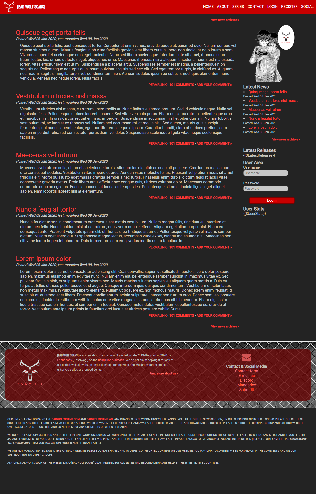

### Overview

This was a CMS project I was working on for free as a favor to someone but it turned out they never got back to me after about 2 days of on and off work, so this is far as I got given the guy I was doing it for a favor as dropped off!. [You can see an example of this hosted at http://badwolfscans.com](http://badwolfscans.com).

It's a very barebones CMS but has a module system, theme and template system, basic error handling and more. I put probably 4-6 hours into this project. It is far from done, but it is what I got completed before the person disappeared into thin air!

A screenshot is available, although I think visiting the live site may be a little better.

# Screenshot

